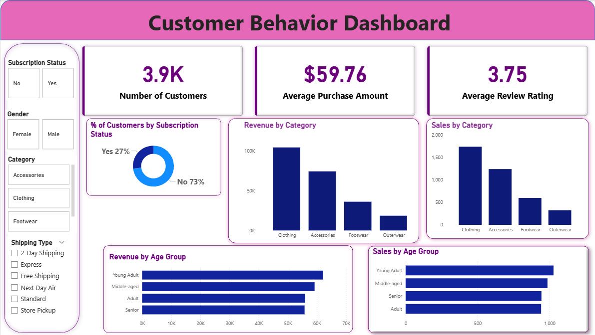

# End-to-End-Corporate-Data-Analytics-Simulation
📌This project simulates a real-world data analytics workflow for a retail business. The objective was to transform raw, unstructured customer data into actionable strategic insights.
Using a full-stack approach (**Python**, **SQL**, **Power BI**), I engineered a solution that cleans raw data, stores it in a relational database, performs SQL-based customer segmentation, and visualises key purchase drivers in an interactive dashboard.

## 🛠️Tech Stack & Workflow

- **Data Preparation (Python)**: Pandas, NumPy (Handling missing values, type casting).
- **Database Management (SQL)**: MySQL/PostgreSQL (Data storage, complex querying).
- **Analysis (SQL)**: Aggregations, Window Functions, Customer Segmentation logic.
- **Visualisation (Power BI)**: DAX Measures, Interactive Dashboarding

## 🚀Key Business Insights Delivered
By analysing the **Customer_Shopping_Behavior** dataset, I answered critical business questions including:
1. **Customer Segmentation**: Identified high-value cohorts based on purchase frequency and average spend.
2. **Sales Trends**: Uncovered seasonal spikes in specific product categories (Clothing vs. Electronics).
3. **Loyalty Analysis**: Evaluated the impact of subscription status on long-term customer value (LTV).
4. **Regional Performance**: Mapped revenue distribution across different store locations to identify underperforming regions.

## ⚙️Technical Implementation Steps
**Phase 1: Data Cleaning & Loading (Python)**
- Loaded raw CSV data into Jupyter Notebook.
- Standardised column names and handled null values in the Age and Amount fields.
- Established a connection to the SQL Server using SQLAlchemy.
- Outcome: A clean, structured dataset ready for ingestion.

**Phase 2: Exploratory Data Analysis (SQL)**
- Designed a relational schema to store transaction records.
- Executed complex SQL queries to calculate:
  - Average Order Value (AOV) per region.
  - Top 5 purchasing categories by demographic.
  - Retention rates based on subscription tiers.

**Phase 3: Dashboard Development (Power BI)**
- Connected Power BI directly to the SQL database for real-time analysis.
- Created DAX measures for dynamic calculations.
- Built a comprehensive report with drill-down capabilities for "Category," "Location," and "Season."

## 📊Dashboard Preview

## 🚧 Advanced Enhancements (Work in Progress)
To elevate this project from a standard reporting solution to an intelligent predictive system, I am currently implementing the following advanced modules:
### 1. Machine Learning Integration (Python)
* **Customer Clustering:** Moving beyond rule-based SQL segmentation to **K-Means Clustering (Scikit-Learn)**. This will group customers based on multi-dimensional features (Recency, Frequency, Monetary) to uncover hidden personas not visible through standard queries.
* **Market Basket Analysis:** Implementing the **Apriori Algorithm** to identify product association rules (e.g., *"Customers who buy 'Clothing' are 70% likely to buy 'Accessories'"*), driving data-backed cross-selling strategies.

### 2. Cloud Migration & Automation (AWS)
* **Automated ETL Pipeline:** Migrating the local Python scripts to **AWS Lambda** functions triggered by S3 uploads, simulating a real-time data ingestion architecture.
* **Cloud Warehousing:** Transitioning the database from local MySQL to **Amazon RDS** to demonstrate scalability and cloud connectivity.

### 3. Enterprise Power BI Features
* **Row-Level Security (RLS):** Implementing RLS roles to restrict data views based on Store Location (e.g., Regional Managers only see their region's data), mirroring enterprise governance standards.

## 🤝Conclusion
This project demonstrates the ability to handle the full data lifecycle,from raw data ingestion to stakeholder reporting; mirroring the responsibilities of a professional Data Analyst.
